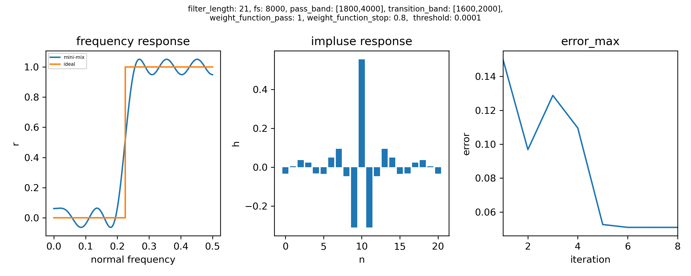

# ADSP 2023 Spring HW1

## Mini-Max FIR Filter

- step1: 
    - Initialize values of Fm (avoid the transition band).
- step2: 
    - Find the vecter S with the equation: A * S = B.
- step3: 
    - Compute the error with the equation: err(F) = [R(F) - Hd(F)] * W(F), R(F) is sum of s[n] * cos(2n * pi * F) , n = 0, 1,..., k.  
- step4: 
    - Find new extreme points Fm with err(F). 
- step5: 
    - Let E0 = max(err(F)), E1 = max(err_last_iteration(F))
    - If E1 - E0 > threshold or  E1 - E0 < 0 then go back to step2, else go to step6.
- step6: 
    - h[k] = s[0], h[k+n] = h[k-n] = s[n]/2, n = 1, 2,..., k. 
    - Plot the graphs of frquency response, impulse response, and the max error of each iteration.

## Results of default parameters
- filter length = 21
- fs = 8000 Hz
- pass band = [1800,4000]
- transtion band = [1600,2000]
- pass band weight function = 1
- stop band weight function = 0.8
- threshold = 0.0001



<div style="break-after: page; page-break-after: always;"></div>

---

## Run the code
- Environment: Python 3.8
- Install packages: 
```
pip3 install -r requirements.txt
```
- Use default parameters: 
```
python3 main.py
```
- Use custom parameters: 
```
python3 main.py --filter_length {filter_length} \
				--fs {fs} \
				--pass_band_L {pass_band_L} \
				--pass_band_H {pass_band_H} \
				--transition_band_L {transition_band_L} \
				--transition_band_H {transition_band_H} \
				--WFP {WFP} \ 
				--WFS {WFS} \
				--threshold {threshold}
```
- Output:
	1. Graph of frequency response.
	2. Graph of impulse response.
	3. Graph of iteration error_max.
	4. Show values of iteration error_max on terminal.
- Graph of results:
	- results.png